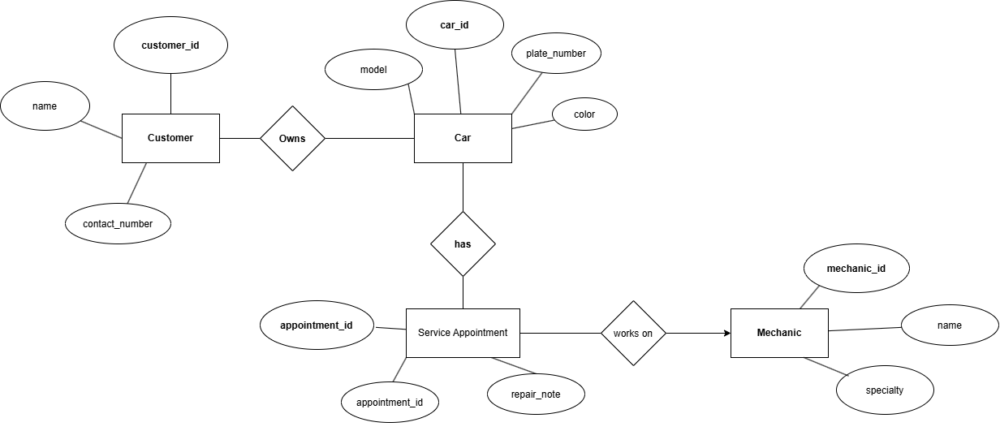

# INFOMAN1 – Week 2 Lab: Conceptual ERD Case Study

**Name:** [Your Full Name]
**Student ID:** [Your Student ID]
**Section:** [Your Section]

## Task 1 — Candidate Entities

| Entity              | Justification                                                                                                                                                                              |
| ------------------- | ------------------------------------------------------------------------------------------------------------------------------------------------------------------------------------------ |
| Customer            | The scenario states that the shop has many customers and that each customer may bring one or more cars for repair, so Customer is a separate entity with its own information.              |
| Car                 | The scenario states that each car has a model, plate number, and color and belongs to exactly one customer, making Car a separate entity.                                                  |
| Mechanic            | The scenario states that the shop employs several mechanics and that each mechanic has a name and specialty, so Mechanic is a separate entity.                                             |
| Service Appointment | The scenario states that a mechanic works on a car during a scheduled service appointment and that each appointment has a date and repair note, so it represents a specific service event. |

## Task 2 — Attributes per Entity

### Customer

* **Primary Key:** customer_id
* **Attributes:**

  * customer_id — Domain: numeric
  * name — Domain: text
  * contact_number — Domain: text

### Car

* **Primary Key:** car_id
* **Attributes:**

  * car_id — Domain: numeric
  * model — Domain: text
  * plate_number — Domain: text
  * color — Domain: text

### Mechanic

* **Primary Key:** mechanic_id
* **Attributes:**

  * mechanic_id — Domain: numeric
  * name — Domain: text
  * specialty — Domain: text

### Service Appointment

* **Primary Key:** appointment_id
* **Attributes:**

  * appointment_id — Domain: numeric
  * appointment_date — Domain: date
  * repair_note — Domain: text

## Task 3 — Relationships

| Relationship (verb phrase) | Between                        | Cardinality | Checked both directions?                                                                                                       |
| -------------------------- | ------------------------------ | ----------- | ------------------------------------------------------------------------------------------------------------------------------ |
| owns                       | Customer ↔ Car                 | 1:N         | Yes — one customer may own one or more cars, while each car belongs to exactly one customer.                                   |
| has                        | Car ↔ Service Appointment      | 1:N         | Yes — one car may have many service appointments over time, while each service appointment is for one car.                     |
| works on                   | Mechanic ↔ Service Appointment | 1:N         | Yes — one mechanic may work on many service appointments over time, while each service appointment is handled by one mechanic. |

The relationship between **Mechanic and Car** can also be viewed as many-to-many over time. One mechanic can work on many cars, and one car can be serviced by different mechanics on different visits. The **Service Appointment** entity represents the individual service event that connects the mechanic and car.

## Task 4 — Conceptual ERD

The ERD represents customers owning cars, cars having service appointments, and mechanics working on service appointments. Each service appointment records the date and repair note.
